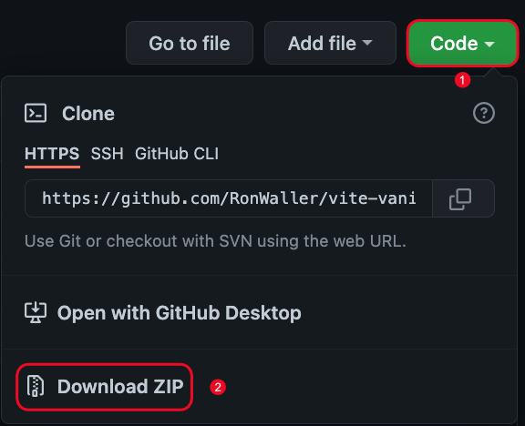
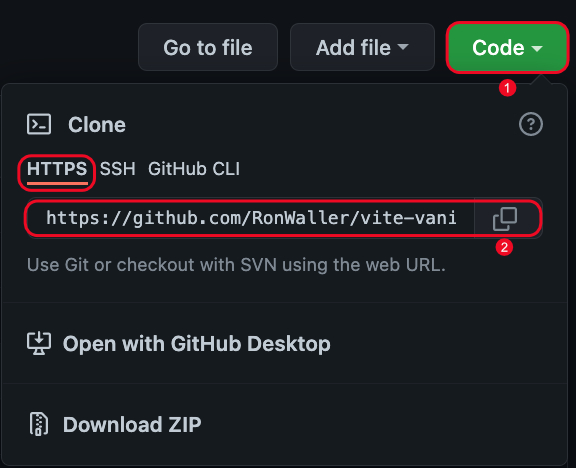

# Vite Vanilla Project Builder

This repository will help create a boilerplate vanilla javascript project using Vite. When downloading the repo locally all future projects can be created just by copying and renaming folder your project name.

<br>

## Badges


## Dev Dependencies

-   [Vite](https://vitejs.dev/)
-   [Eslint](https://www.npmjs.com/package/eslint)
-   [Prettier](https://prettier.io/docs/en/install.html)
-   [Bable](https://babeljs.io/docs/en/)
-   [Typescript](https://www.npmjs.com/package/typescript)
-   [Wes Boss Eslint and Prettier Config](https://github.com/wesbos/eslint-config-wesbos)

<br>

- [Vite Vanilla Project Builder](#vite-vanilla-project-builder)
  - [Badges](#badges)
  - [Dev Dependencies](#dev-dependencies)
  - [Tech Stack](#tech-stack)
  - [Usage](#usage)
  - [Installation](#installation)
      - [Download Zip File](#download-zip-file)
      - [Clone the project](#clone-the-project)
  - [Open Terminial](#open-terminial)
  - [Build Project](#build-project)
  - [Open in Editor (VS Code)](#open-in-editor-vs-code)
  - [License](#license)

## Tech Stack

**Client:** HTML, SCSS, Javascript

## Usage

There two options to use this repo

-   Download Zip file
-   Clone repo

## Installation

#### Download Zip File

-   Click Code Button (1)
-   Download Zip (2)
-   Unzip file
-   Move folder to project location
    -   Rename folder to project name OR
    -   Copy repo folder for each project and rename to project name

</br>



#### Clone the project

-   Click Clone Button (1)
-   Select HTTPS
-   Copy link (2)

</br>



## Open Terminial

-   Navigate to projects folder
-   Clone repository into projects folder
    -   Rename folder to project name OR
    -   Copy repo folder for each project and rename to project name

```bash
  git clone https://github.com/RonWaller/vite-vanilla-project-starter.git
```

Go to the project directory

-   Rename folder to your project name

```bash
  mv vite-vanilla-project-starter your-project-name-here
  cd your-project-name-here
```

Install dependencies

```bash
  npm install
```

Start the dev server

```bash
  npm run dev
```

## Build Project

To build this project run

```bash
  npm run build
```

## Open in Editor (VS Code)

```bash
  code .
```

## License

[](https://opensource.org/licenses/MIT)
